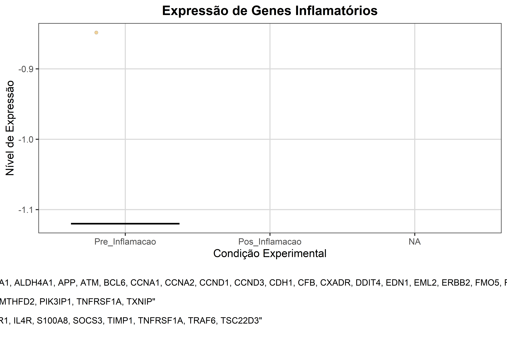
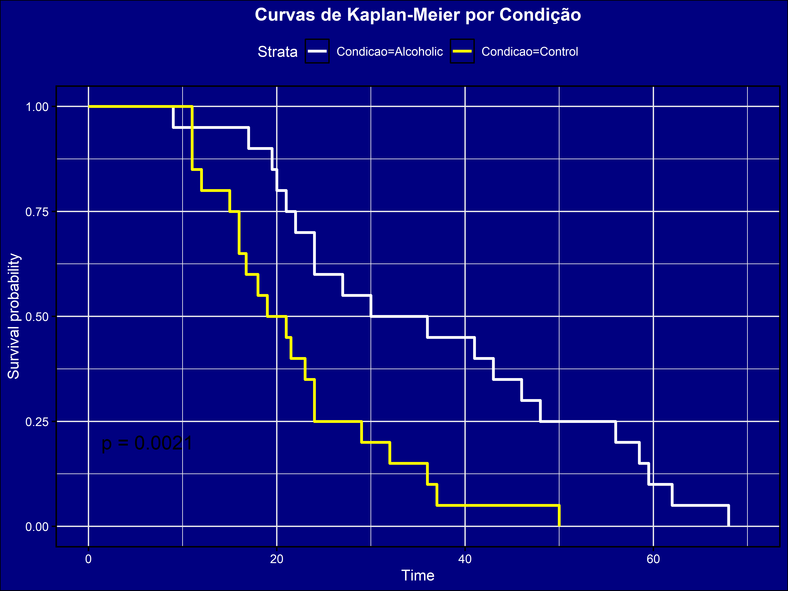

# 🧠 Impacto do Álcool no Hipocampo  

Este é um projeto **pessoal** de ciência de dados aplicada à biomedicina.  
O objetivo é explorar, de forma prática, como o **consumo de álcool** pode impactar o **hipocampo** através da **expressão de genes ligados à inflamação**.  

O projeto funciona como um **portfólio**, unindo programação em **R**, análise de dados, estatística e visualização científica.  
Os **detalhes completos da análise** estão documentados no relatório [`report.Rmd`](report.Rmd).  

👩‍💻 **Autora:** Valkiria Franzoni dos Anjos da Costa  
📧 **Email:** valkiriafranzoni@gmail.com  
🔗 **LinkedIn:** [linkedin.com/in/valkiria-franzoni](https://www.linkedin.com/in/valkiria-franzoni)

---

## 🎯 Objetivo

- Exercitar o uso de **R** em análises biológicas.  
- Investigar genes inflamatórios (**IL1B, IL6, TNF-α**) associados à resposta inflamatória no hipocampo.  
- Explorar como mudanças nesses genes podem estar relacionadas a efeitos do consumo de álcool.  
- Demonstrar **boas práticas em ciência de dados**: dados crus, scripts reprodutíveis e documentação.  

---


## 📂 Estrutura do Projeto  

```bash
hipocampo_gene_alcool/
│── data/          # dados brutos e tratados  
│── scripts_R/     # scripts organizados para cada etapa da análise  
│── imagens/       # gráficos gerados (boxplots, Kaplan-Meier etc.)  
│── resultados/    # tabelas finais exportadas  
│── report.Rmd     # relatório completo em RMarkdown  
│── run_all.R      # script para executar toda a pipeline  
│── README.md      # este arquivo  


---

## 🔬 Metodologia (resumida)  

1. **Pré-processamento**  
   - Limpeza e organização dos dados.  
   - Normalização das expressões gênicas.  

2. **Análise exploratória**  
   - Distribuição de expressão dos genes inflamatórios.  
   - Visualizações: boxplots, tendências de expressão.  

3. **Modelagem de sobrevivência (Kaplan-Meier)**  
   - Comparação entre grupos (álcool vs. controle).  

4. **Discussão inicial**  
   - Identificação de possíveis vias inflamatórias envolvidas.  
   - Interpretação dos resultados como exercício de portfólio.  

---

## 🧬 Genes e Fases Inflamatórias  

Neste projeto, foram avaliados três genes centrais na resposta inflamatória:  

- **IL1B** → fase de **exposição ao álcool**, funcionando como gatilho inicial da inflamação.  
- **IL6** → fase de **propagação**, aumenta após o processo inflamatório agudo.  
- **TNF-α** → fase de **manutenção crônica / neurodegenerativa**, sustentando a inflamação no longo prazo.  

📌 **Inflamação na abstinência:**  
Durante a abstinência do álcool, observou-se uma **queda na expressão de IL6**, sugerindo uma tentativa inicial de recuperação.  
Porém, essa redução não foi sustentada: após a abstinência, os níveis voltaram a subir → **efeito rebote inflamatório**, indicando sinais residuais de inflamação no hipocampo.  

---

## 📊 Resultados Visuais  

### Expressão de Genes Inflamatórios  
  

### Curvas de Kaplan-Meier  
  

### Tendência da Expressão Gênica  
  

---

## 🚀 Como Usar  

Clone o repositório e rode os scripts em R:  

```bash
git clone https://github.com/ValkiriaFranzoni/hipocampo_gene_alcool.git
cd hipocampo_gene_alcool
Rscript run_all.R


📌 Conclusão

Os resultados sugerem que o consumo crônico de álcool está associado a alterações inflamatórias persistentes no hipocampo.
Mesmo após períodos de abstinência, sinais inflamatórios se mantêm, reforçando o papel da inflamação crônica em processos neurodegenerativos.

Este projeto não é acadêmico, mas sim um exercício de bioinformática aplicada, servindo como portfólio para análises em R, com foco em reprodutibilidade, organização e ciência de dados aplicada à saúde.


📚 Referências

Flatscher-Bader T, van der Brug M, Landis N, Wilce PA. Stress-response pathways are altered in the hippocampus of chronic alcoholics. Alcohol. 2013;47(6):505-515.
📎 PubMed: 23981442

📎 PMC (suplementos .xlsx): PMC3836826
